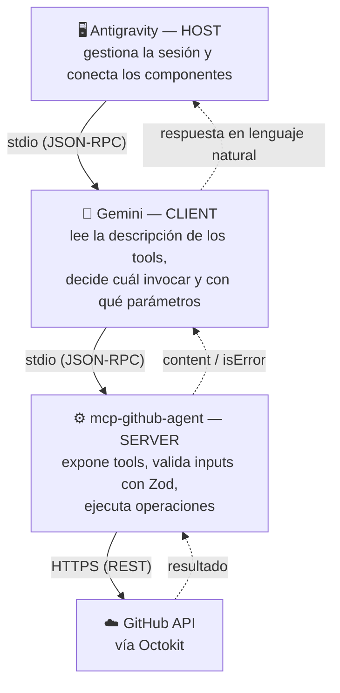

# 🐙 mcp-github-agent

> Servidor **MCP (Model Context Protocol)** en Node.js + TypeScript que conecta un LLM directamente con la API de GitHub. Permite crear repositorios, ramas, commits, issues y pull requests a partir de instrucciones en lenguaje natural.

Pensado para ser consumido por un Host (**Antigravity**) y un LLM cliente (**Gemini**).

---

## 📋 Tabla de contenidos

- [💡 Casos de uso](#-casos-de-uso)
- [🏗️ Arquitectura](#️-arquitectura)
- [📦 Requisitos](#-requisitos)
- [🚀 Instalación](#-instalación)
- [⚙️ Configuración](#️-configuración)
- [🔌 Configuración de Antigravity](#-configuración-de-antigravity)
- [📜 Scripts disponibles](#-scripts-disponibles)
- [🛠️ Tools disponibles](#️-tools-disponibles)
- [🔗 Flujo de demo sugerido](#-flujo-de-demo-sugerido)
- [⚠️ Manejo de errores](#️-manejo-de-errores)
- [🧪 Testing](#-testing)
- [🔧 Troubleshooting](#-troubleshooting)
- [📘 Manual técnico](./MANUAL_TECNICO.md)
- [📄 Licencia](#-licencia)
- [👩‍💻 Desarrolladora](#-desarrolladora)

---

## 💡 Casos de uso

| Escenario | Sin `mcp-github-agent` | Con `mcp-github-agent` |
|---|---|---|
| Crear un repositorio | Ir a GitHub, llenar el formulario de "New repository" | *"Creá un repo privado llamado 'mi-proyecto'"* |
| Reportar un bug | Navegar al repo, abrir un issue, completar el formulario | *"Abrí un issue que diga 'Error 500 en /login'"* |
| Empezar una feature | `git checkout -b feature/nueva` a mano | *"Creá la rama 'feature/nueva' a partir de main"* |
| Subir un cambio | `git add`, `git commit`, `git push` manual | *"Commiteá este archivo en la rama X con el mensaje Y"* |
| Pedir un code review | Abrir el PR manualmente en la UI de GitHub | *"Abrí un pull request de 'feature/nueva' hacia main"* |
| Cerrar un issue resuelto | Ir al issue, apretar "Close" | *"Cerrá el issue #12"* |

Todo esto encadenado en una sola conversación: el LLM decide qué tool usar y en qué orden, según el pedido en lenguaje natural — no hace falta indicarle paso a paso qué operación ejecutar.

---

## 🏗️ Arquitectura



La comunicación entre Antigravity y este servidor es vía **stdio** (JSON-RPC sobre `stdin`/`stdout`), no HTTP — el Host lanza el servidor como subproceso local, sin necesidad de puerto ni red.

### 📂 Estructura del código

```
src/
  server.ts       → entry point: crea el McpServer, registra tools, conecta stdio
  types.ts        → tipos compartidos
  schemas/        → un schema de Zod por tool (valida input + documenta para el LLM)
  github/
    client.ts     → instancia de Octokit configurada con el token (separado para poder mockear)
    operations.ts → una función por operación de GitHub, con retry + traducción de errores
  errors/         → tipos de error custom y transformación a lenguaje natural
  utils/
    logging.ts    → logging a stderr (nunca a stdout, nunca datos sensibles)
    retry.ts      → backoff exponencial para rate limiting
  tools/          → un archivo por tool: registra el tool en el server y arma su handler
tests/            → tests con Vitest, Octokit siempre mockeado
```

---

## 📦 Requisitos

| Requisito | Versión mínima | Notas |
|---|---|---|
| **Node.js** | 18.x | probado en 20.x |
| **npm** | incluido con Node | — |
| **Cuenta de GitHub** | cualquier plan | con permisos para generar un [Personal Access Token](https://github.com/settings/tokens) |
| **Antigravity** | — | Host que conecta el LLM (Gemini) con este servidor |

Verificá tu versión de Node con:
```bash
node --version
```

---

## 🚀 Instalación

```bash
git clone https://github.com/ACPerezJulia/mcp-github-agent.git
cd mcp-github-agent
npm install
```

---

## ⚙️ Configuración

### 1. Generar el Personal Access Token (PAT)

1. Andá a GitHub → `Settings → Developer settings → Personal access tokens → Tokens (classic)` → `Generate new token`.
2. Marcá los siguientes scopes:

   | Scope | ¿Para qué se usa? |
   |---|---|
   | `repo` | Necesario para los 8 tools que operan sobre repositorios (leer/escribir repos, issues, ramas, contenido de archivos y pull requests) |
   | `user` | Necesario para operar como el usuario autenticado (ej: `create_repository` lo crea bajo tu usuario) |
   | `admin:org` | No lo usa ninguno de los 9 tools de este repo — se deja documentado porque el enunciado original lo pedía para posibles operaciones a nivel organización |

   > **Mínimo recomendado:** `repo` + `user`

3. Copiá el token generado (no lo vas a poder ver de nuevo).

### 2. Configurar el `.env`

```bash
cp .env.example .env
```

Pegá el token en `.env`:

```env
GITHUB_TOKEN=ghp_tu_token_aca
```

> ⚠️ **El archivo `.env` nunca se commitea** (está en `.gitignore`).

> 🔒 **Detalle de seguridad:** `client.ts` resuelve la ruta al `.env` de forma absoluta, calculada desde la ubicación del propio archivo (no desde el directorio de trabajo del proceso que lo ejecuta). Esto significa que funciona sin importar quién lo lance ni desde dónde — no hace falta exponer ni copiar el token en ningún archivo de configuración de Antigravity.

### 3. Compilar

```bash
npm run build
```

### 4. Verificar la instalación

```bash
npm start
```

El proceso queda esperando mensajes por `stdin` (comportamiento esperado de un servidor stdio) — si no tira ningún error y queda "colgado" ahí, la instalación fue exitosa. Cortalo con `Ctrl+C`.

---

## 🔌 Configuración de Antigravity

Antigravity ejecuta este servidor como subproceso vía `command`/`args` en su archivo de configuración de MCP servers.

1. En Antigravity: `"..." (Additional Options) → MCP Servers → Manage MCP Servers → View raw config`. Esto abre `mcp_config.json` (en Windows: `C:\Users\<usuario>\.gemini\antigravity\mcp_config.json`).
2. Agregá una entrada apuntando al `dist/server.js` compilado, con **ruta absoluta**:

   ```json
   {
     "mcpServers": {
       "github-agent": {
         "command": "node",
         "args": ["<ruta-absoluta-al-repo>/dist/server.js"]
       }
     }
   }
   ```

3. Guardá el archivo. En el panel de MCP Servers de Antigravity, `github-agent` debería aparecer conectado, exponiendo 9 tools.

> 💡 **Tip para desarrollo:** si preferís no recompilar cada vez que cambiás algo, podés apuntar `command`/`args` a `npx` + `tsx` + `src/server.ts` en vez de `node` + `dist/server.js` — corre el TypeScript directo. Para la versión "de producción" que se usa en la demo, mejor el `.js` ya compilado.

> ⚠️ Antigravity ejecuta el `.js` ya compilado, no el `.ts` fuente. Corré `npm run build` después de cada cambio, y **reconectá el servidor** desde el panel de MCP Servers de Antigravity para que tome el código nuevo (el proceso viejo sigue corriendo con el código anterior hasta que lo reiniciás).

---

## 📜 Scripts disponibles

| Script | Qué hace |
|---|---|
| `npm run build` | Compila TypeScript (`src/`) a JavaScript (`dist/`) |
| `npm run dev` | Corre el servidor en modo desarrollo con recarga automática (`tsx`) |
| `npm start` | Corre el servidor ya compilado (`dist/server.js`) |
| `npm test` | Corre la suite de tests con Vitest |

---

## 🛠️ Tools disponibles

### 🏓 `ping`

Tool trivial sin parámetros que responde `pong`. Sirve para verificar que el servidor está vivo y que el pipeline Antigravity → Gemini → MCP Server está funcionando de punta a punta.

**Ejemplo de prompt:** `"usá la tool ping para verificar la conexión"`

### 📋 `list_repositories`

Lista los repositorios del usuario autenticado.

| Parámetro | Tipo | Obligatorio | Descripción |
|---|---|:---:|---|
| `visibility` | enum | No (default `all`) | `all`, `public` o `private` |

**Ejemplo de prompt:** `"listame mis repositorios privados de GitHub"`

### ➕ `create_repository`

Crea un nuevo repositorio bajo el usuario autenticado.

| Parámetro | Tipo | Obligatorio | Descripción |
|---|---|:---:|---|
| `name` | string | Sí | 1-100 caracteres, solo letras/números/`.`/`-`/`_`, no puede terminar en `.git` ni `.wiki` |
| `description` | string | No | Descripción breve del repositorio |
| `private` | boolean | No (default `false`) | Si es `true`, el repo se crea privado |

**Ejemplo de prompt:** `"creá un repositorio privado llamado 'mi-proyecto' con la descripción 'proyecto de prueba'"`

### 🐛 `create_issue`

Crea un issue en un repositorio existente.

| Parámetro | Tipo | Obligatorio | Descripción |
|---|---|:---:|---|
| `owner` | string | Sí | Usuario u organización dueño del repo |
| `repo` | string | Sí | Nombre del repositorio |
| `title` | string | Sí | Título del issue (máx. 256 caracteres) |
| `body` | string | No | Descripción en Markdown (máx. 65536 caracteres) |
| `labels` | string[] | No | Labels a asignar |

**Ejemplo de prompt:** `"creá un issue en ACPerezJulia/mcp-github-agent que diga 'agregar validación extra' con el label 'enhancement'"`

### 📃 `list_issues`

Lista los issues de un repositorio.

| Parámetro | Tipo | Obligatorio | Descripción |
|---|---|:---:|---|
| `owner` | string | Sí | Usuario u organización dueño del repo |
| `repo` | string | Sí | Nombre del repositorio |
| `state` | enum | No (default `open`) | `open`, `closed` o `all` |
| `labels` | string[] | No | Filtra issues que tengan estos labels |

**Ejemplo de prompt:** `"mostrame los issues cerrados del repo mcp-github-agent"`

### 📝 `create_commit`

Crea o actualiza un archivo en un repositorio mediante un commit directo sobre una rama (usa la Contents API de GitHub).

| Parámetro | Tipo | Obligatorio | Descripción |
|---|---|:---:|---|
| `owner` | string | Sí | Usuario u organización dueño del repo |
| `repo` | string | Sí | Nombre del repositorio |
| `path` | string | Sí | Ruta del archivo dentro del repo (sin `/` inicial) |
| `content` | string | Sí | Contenido en texto plano (el servidor lo codifica a base64 automáticamente) |
| `message` | string | Sí | Mensaje del commit |
| `branch` | string | No | Rama destino (por defecto, la rama principal del repo) |
| `sha` | string | No | SHA del archivo existente — **obligatorio solo si estás actualizando un archivo que ya existe** |

**Ejemplo de prompt:** `"creá un archivo docs/notas.md en mi repo mcp-agent-test-demo con el contenido 'primera nota' y el mensaje de commit 'docs: agregar notas'"`

### 🌿 `create_branch`

Crea una nueva rama a partir de otra rama base.

| Parámetro | Tipo | Obligatorio | Descripción |
|---|---|:---:|---|
| `owner` | string | Sí | Usuario u organización dueño del repo |
| `repo` | string | Sí | Nombre del repositorio |
| `branchName` | string | Sí | Nombre de la nueva rama (formato de referencia de git válido) |
| `baseBranch` | string | No | Rama base. Si se omite, se usa la rama por defecto del repositorio |

**Ejemplo de prompt:** `"creá una rama llamada 'feature/nueva-funcionalidad' en mi repo mcp-agent-test-demo"`

### 🔀 `create_pull_request`

Crea un pull request entre dos ramas.

| Parámetro | Tipo | Obligatorio | Descripción |
|---|---|:---:|---|
| `owner` | string | Sí | Usuario u organización dueño del repo |
| `repo` | string | Sí | Nombre del repositorio |
| `title` | string | Sí | Título del PR (máx. 256 caracteres) |
| `head` | string | Sí | Rama origen (con los cambios) |
| `base` | string | Sí | Rama destino (ej: `main`) |
| `body` | string | No | Descripción en Markdown |

**Ejemplo de prompt:** `"abrí un pull request desde 'feature/nueva-funcionalidad' hacia 'main' en mcp-agent-test-demo"`

### ✅ `close_issue`

Cierra un issue existente.

| Parámetro | Tipo | Obligatorio | Descripción |
|---|---|:---:|---|
| `owner` | string | Sí | Usuario u organización dueño del repo |
| `repo` | string | Sí | Nombre del repositorio |
| `issueNumber` | number | Sí | Número del issue a cerrar |

**Ejemplo de prompt:** `"cerrá el issue #1 de mcp-agent-test-demo"`

---

## 🔗 Flujo de demo sugerido

Los tools están pensados para encadenarse en un flujo real de trabajo, de punta a punta:

```
create_repository → create_issue → create_branch → create_commit → create_pull_request → close_issue
```

Ejemplo de secuencia de prompts:
1. `"creá un repositorio privado llamado 'demo-flujo'"`
2. `"creá un issue en ese repo que diga 'agregar sección de instalación al README'"`
3. `"creá una rama 'docs/instalacion' en ese repo"`
4. `"en esa rama, creá el archivo README.md con instrucciones de instalación"`
5. `"abrí un pull request desde 'docs/instalacion' hacia 'main'"`
6. `"cerrá el issue que abriste antes"`

---

## ⚠️ Manejo de errores

Los errores de la API de GitHub se traducen a mensajes en lenguaje natural (nunca se expone un stack trace al LLM):

| Situación | Tipo de error | Ejemplo de mensaje |
|---|---|---|
| Token inválido o vencido (401) | `AuthenticationError` | "El token de GitHub no es válido o expiró. Revisá el archivo .env." |
| Falta de permisos (403, sin rate limit) | `AuthenticationError` | "GitHub rechazó la operación por falta de permisos..." |
| Recurso no encontrado (404) | `GitHubAPIError` | "El repositorio o recurso solicitado no fue encontrado..." |
| Archivo existente sin `sha` en `create_commit` (422) | `GitHubAPIError` | "El archivo que intentás commitear ya existe... hace falta indicar su sha actual" |
| Otros datos inválidos (422) | `GitHubAPIError` | Detalle específico devuelto por GitHub |
| Rate limit (403/429) | — | Se reintenta automáticamente con backoff exponencial antes de fallar |
| Sin conexión a internet | `NetworkError` | "No se pudo conectar con GitHub. Verificá tu conexión..." |

---

## 🧪 Testing

```bash
npm test
```

22 tests con Vitest cubriendo schemas, operaciones (Octokit mockeado) y transformación de errores. Los tests **nunca** llaman a la API real de GitHub.

---

## 🔧 Troubleshooting

**"GITHUB_TOKEN no está definido"** al arrancar el server → revisá que `.env` exista en la raíz del proyecto y tenga la variable `GITHUB_TOKEN` cargada.

**Antigravity solo muestra `ping` y no los demás tools** → el proceso del server sigue corriendo con una versión vieja del código. Corré `npm run build` y reconectá `github-agent` desde el panel de MCP Servers.

**Gemini no usa el tool, describe el repo en vez de ejecutar la acción** → sé explícita en el prompt, mencionando el nombre del tool (ej: "usá la tool `list_repositories`..."). Si el prompt es muy genérico, el LLM puede preferir usar sus propias herramientas de lectura de código en vez del tool MCP.

**Error 401 al llamar cualquier tool** → el token venció o no tiene los scopes necesarios (`repo`, `user`). Generá uno nuevo y actualizá `.env`.

**Error 404 en `create_issue`, `list_issues` o `create_commit`** → verificá que `owner`/`repo` estén bien escritos y que el token tenga acceso a ese repositorio.

> 📘 ¿Vas a modificar o mantener este proyecto? [`MANUAL_TECNICO.md`](./MANUAL_TECNICO.md) tiene el registro de incidentes reales encontrados durante el desarrollo (causa raíz, diagnóstico, solución, commit) y una guía paso a paso de cómo agregar un tool nuevo.

---

## 📄 Licencia

MIT © 2026 Halina87

---

## 👩‍💻 Desarrolladora

**Analía C. Pérez Juliá**
Bootcamp Soy Henry · Proyecto Integrador Módulo 5 (Backend)
GitHub: [@ACPerezJulia](https://github.com/ACPerezJulia)
